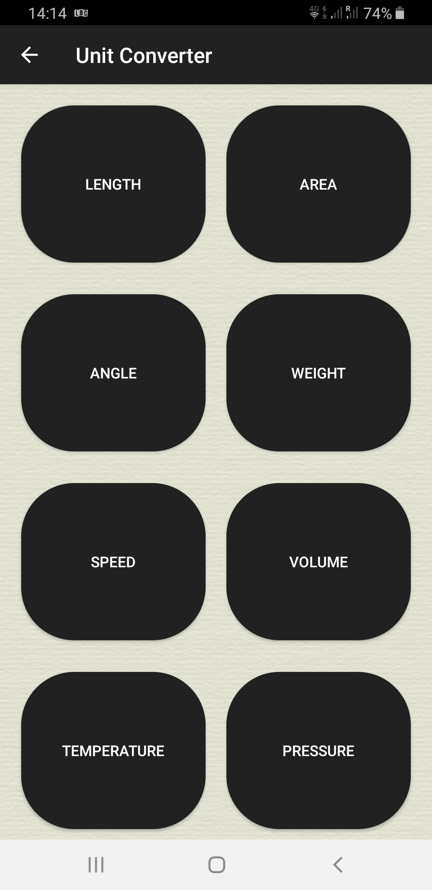
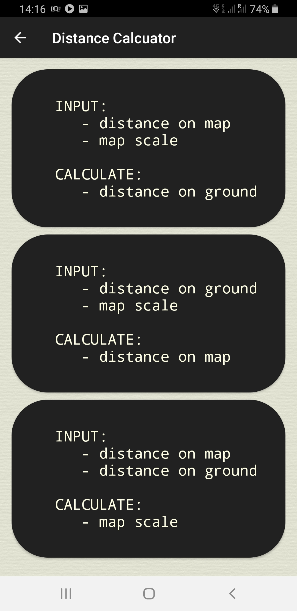

# map-tools-app
An android app that includes set of tools useful when converting map scales, distances and coordinates.

A few converters/calculators one might find handy when reading maps.

## Table of contents
* [General Info](#general-info)
* [Technologies](#technologies)
* [Setup](#setup)
* [Features](#features)
* [Status](#status)
* [License](#license)
* [Contact](#contact)

# General Info

A set of map tools consisting of:
 - unit converters
 - scale converters
 - distance / scale calculators
 - coordinate converters (coming soon)
 - polygon area and perimeter calculators (coming soon)

	
	
	
	

# Technologies
- Java JDK 1.8
- Android v21 - 28
- Android Studio
- Gradle

**Plugins and libraries**
- JCoord version 1.0 by Jonathan Stott (coordinate conversions only)

# Setup

Clone the repository to a folder on your computer and import it into Android  Studio

# Features

There are 5 options, each serving different set of calculation/conversion.

### Option 1 - Unit Converter

Converts units in 8 categories:

 - length
 - area
 - weigth (coming soon)
 - angle (coming soon)
 - speed (coming soon)
 - volume (coming soon)
 - temperature (coming soon)
 - pressure(coming soon)

	
	
	
	

	

### Option 2 - Scale Converter

Converts map scales between each other expressed in 5 different map scale formats.
A value entered in one of the formats gets converted into the remaining four.

 - Fractional (eg. 1:10,000)
 - Imperial/inches to the mile (eg. 6 in to the mile)
 - Imperial/miles to an inch (eg. 4 miles to an inch)
 - Metric/centimetres to a kilometre (eg. 4cm to a km)
 - Metric/kilometres to a centimetre (eg. 2km to a cm)

	
	

	

### Option 3 - Distance Calculator

When reading maps you deal with (among other things):

 - map measurement - length between points measured on the map
 - ground distance - distance between those points on the ground
 - map scale - the scale of the map

There are three types of calculations that can be done here - knowing any two of the above three figures allows you to calculate the third one:
 - knowing the scale and the distance on the map you can calculate the distance on the ground
 - knowing the scale and the distance on the ground you can calculate the distance on the map
 - knowing the distance on the map and the distance on the ground you can calculate the scale

Once calculation is done you can freely switch between available units converting the values to the system (metric, imperial) most digestable to you.

	
	
	

### Tab3 - Coordinate Converter

  To be developed.

### Tab4 - Area & Perimeter Calculator

 To be developed

# Status
- Development: Open

# License
MapToolsApp is free software: you can redistribute it and/or modify it under the terms of the GNU General Public
License as published by the Free Software Foundation, either version 3 of the License, or (at your option) any later version.
MapToolsApp is distributed in the hope that it will be useful, but WITHOUT ANY WARRANTY; without even the implied warranty of  MERCHANTABILITY or FITNESS FOR A PARTICULAR PURPOSE.  See the GNU General Public License for more details.
You should have received a copy of the GNU General Public License along with MapToolsApp.  If not, see http://www.gnu.org/licenses/ or write to: latidude99@gmail.com

# Contact
You can email me at latidude99@gmail.com
